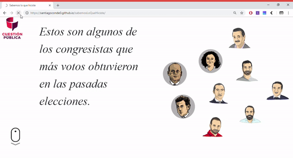
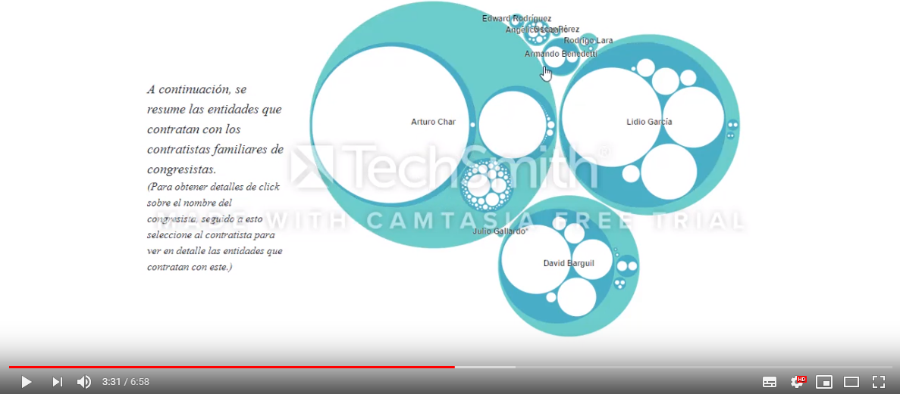
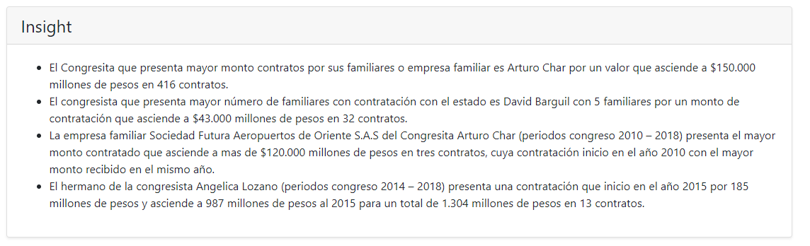

# *Sabemos lo que hiciste - familiares de congresistas contratistas del estado*

" Sabemos lo que hiciste - familiares de congresistas contratistas del estado " is a project for the   [*Visual Analytics*](http://johnguerra.co/classes/visual_analytics_fall_2018/)  class fall 2018 [*Universidad de los Andes*](https://uniandes.edu.co/)

## [Demo link](https://santiagoconde0.github.io/sabemosLoQueHiciste/)

## How to run?

Clone the repository an lauch in your favorite web server, e.g.:

    git clone https://github.com/santiagoconde0/sabemosLoQueHiciste   
    cd sabemosLoQueHiciste
    http-server

    ## [Presentation](https://santiagoconde0.github.io/sabemosLoQueHiciste/presentation.html)

# Technologies used

* HTML 5
* CSS
* Javascript
* [D3 v5](https://d3js.org/)
* [jQuery](https://jquery.com/)
* [Bootstrap](https://getbootstrap.com/)
* [RevealJS](https://revealjs.com)
* [RevealVizScroll](https://github.com/john-guerra/revealVizScrollyteling)
* [Vegalite](https://vega.github.io/vega-lite/)

## Video explanation

# [FW TAMARA](https://santiagoconde0.github.io/sabemosLoQueHiciste/tamara.html)

## Insights

## DATA

* the data was provided by  [Cuestion Pública](https://cuestionpublica.com/)

Viz Stacked Bar Chart based  by Mike Bostock https://bl.ocks.org/mbostock/3886208

## Authors

[Santiago Suárez Conde](https://github.com/santiagoconde0)

[Martha Cardenas](https://github.com/mlcardenas18)

## Paper
Enlace al documento https://github.com/santiagoconde0/sabemosLoQueHiciste/blob/master/Documentation/Paper%20Proy_SabesLoqueHicitesFamiliasdecongresisconcont.pdf
